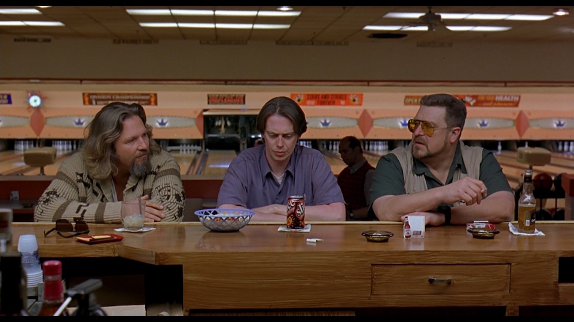

# BowlingAPI

## Premise
An API to power a bowling alley's logic and display, providing users the ability to create a game, update a game, and get info about that game.

## Environment
BowlingAPI was developed with:
 1. Node    v4.4.7
 2. MongoDB v3.2.4

## Setup
### Local Variables
BowlingAPI reads several variables from the environment.

Before running, export the desired environment 
 1. `export NODE_ENV=development` || defaults to `development`, runs in `test` when testing
 2. `export NODE_LOG_LEVEL=debug` || defaults to `debug`, can be changed to throttle log level
 3. `export PORT=9000`            || defaults to `9000`, can be changed to avoid conflict
 
Export these variables either in the terminal or in your `.bashrc` or other terminal profile file before running.

Important: `NODE_ENV` dictates what MongoDB database to use. Development uses the `bowlingAPI-dev` database, while testing uses the `bowlingAPI-test` database. 

### NPM Install
Don't forget to NPM INSTALL!

Ahem. *Don't forget to npm install!*

## Running
 1. `npm run watch` is the preferred way to serve the app for development 
 2. `npm run start` can be used in other environments
 3. `npm run test` will load and run mocha, which runs the tests
 
## Testing, Automated and Manual
Testing was done with the Mocha and Chai libraries. Tests can be run totally (`npm run test`) or file by file for greater control (`mocha test/util.createRound.test.js`).

Besides the included automated tests, there is also a [Postman collection](docs/BowlingAPI.postman_collection.json) for ease of manual testing. To use, download and import the collection into Postman. 

Remember to change the routes for the `get` and `update` routes to include the id of a game that exists in that collection.

## Endpoints

### CREATE 
 * Route  |  /game
 * Method |  POST
 * Body   |  `{ players: ['First','Second'] }`
 * Description | Creates a new game with given players 
 * Returns | Game state

### READ

 * Route | /game/:gameId
 * Method | GET
 * Parameter | gameId 
 * Description | Gets the game's current state, including total scores for players
 * Returns | Game state organized by frame and by player (total scores)

### UPDATE

 * Route | /game/:gameId
 * Method | PUT
 * Parameter | gameId 
 * Body    | `{ rolls: 4}`
 * Description | Updates the given game's current player and current round with the pins knocked down in that roll
 * Return  | Player state
   
## Future Development
Security and containerization are two areas that I would like to develop more with this project. 

 * A simple JWT authorization module could be used to authorize users making API calls.
 * Docker might be useful, since the project could dockerize both an app and a database. (Or even better: a replica set.)
   
## Post-Mortem 
I wanted to create an API that would require minimal work for the user/bowling alley, while I was also curious about event streaming databases: a database that doesn't hold one canonical record that is transformed over time, but instead keeps a stream of events.
  
An example might be a stream for a bank account: rather than hold one account with a balance, the bank streams all the events for the user--all the deposits and withdrawals--and sums those events up to provide a snapshot of the current bank account.

I didn't go all the way in designing this bowlingAPI as a streaming, event-processing backend, partly because I wanted to minmize the number of models I used. That is, once I decided not to use a game model to hold essential game info (like who the players are) and only use frames, I had to work out a way to grab all the players for one game.

For future development, I'd consider turning this into a stricter streaming architecture. The frame model already is designed with a nextPlayer field, so perhaps I could use that and an array to only create frames as needed/played.